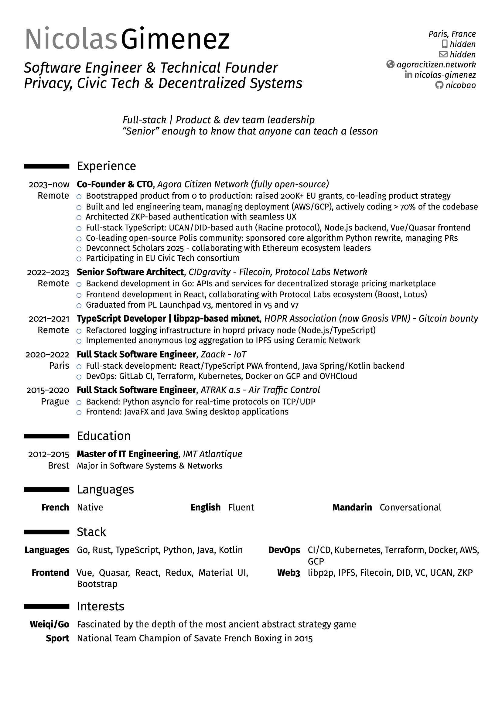

# CV/Cover Letter LaTeX moderncv templates + build tools 
This is my personal CV and my cover letter template. Content unsafe for web has been intentionally removed but the artifacts will still build correctly with dummy information.
This repo is aimed to be used as a basis for your own CV/Cover Letters.

It is based on LaTeX [moderncv template file](http://mirrors.ctan.org/macros/latex/contrib/moderncv/examples/template.tex).

## Example output

My CV with my professional email and dummy phone number:


My cover letter template:


## Installation

### General instructions

Clone the project.

Then install dependencies:
- a LaTeX build system like [texlive](https://tug.org/texlive/acquire-netinstall.html)
- [moderncv package](https://www.ctan.org/pkg/moderncv)
- [fira font](https://www.ctan.org/tex-archive/fonts/fira/)

Make sure the command `pdflatex` works and [Bash](https://www.gnu.org/software/bash/) is correctly installed. Beware that Bash is not shipped by default on Windows.

### Per-OS instructions

#### On Fedora

```
git clone git@github.com:nicobao/cv-cover.git 
# OR
git clone https://github.com/nicobao/cv-cover.git
# then
sudo dnf install texlive texlive-moderncv.noarch texlive-moderncv-doc.noarch texlive-fira-doc.noarch texlive-fira.noarch 
```

## Build

Output files will be stored in the `output/` directory.

### Prerequisites

The following commands assume you're currently in the repository root directory (`cd cv-cover` after your git clone).

### Build all

Run `./build.sh`.

### Build CV

Run `./build-cv.sh`.

Actual content of CV must be stored in `private/shared.tex`.

### Build cover letters

Actual cover letter content must be stored in `private/cover-letters/`. 
They fill `./cover-letter.tex` template file.

The name of the files in `private/cover-letters/` will be reused when outputing the .pdf filenames.

#### Build all letters

Run `./build-cover-letters.sh` to build them all.

#### Build specific letters

Run `./build-cover-letters.sh Company1 Company2` to build cover letters for `Company1` and `Company2`.

For example, to apply to Acme Inc, create `private/cover-letters/Acme.tex` with your cover letter content, and then run `./build-cover-letters.sh Acme` to build only this specific letter.

## Examples

### Private folder

An example of files that should be created in private folder is available in the `example/private` folder.

### Template moderncv

The original official moderncv template file is directly available in `example/template.tex`. It contains helpful comments and can serve as documentation.

## License

The following content:
* git repository including source code and accompanying documentation
* issues
* wiki
are all primarily distributed under the terms of the BSD-Patent License, with portions covered by various OSI-approved licenses.

See [LICENSE-BSD](LICENSE-BSD), and [COPYRIGHT](COPYRIGHT.md) for details.

## Contributing

### Disclaimer

By contributing to this repository, either by opening an issue, updating the wiki, or sending a commit/pull-request via git, you accept to license your work under the [license used by the project](#license).

